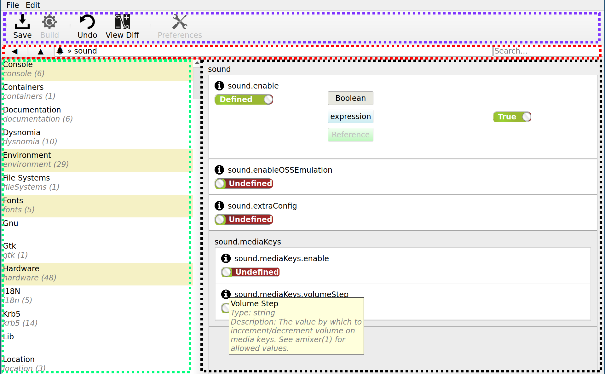

# Interface

Nix-Gui allows for navigation and editing of Nixos options through a
GUI.

The main window may be divided into four sections, the **toolbar**
(purple), the **navbar** (red), the **navlist** (green), and the
**options editors** (black).

## Toolbar

The toolbar consists of three functioning tools:

-   Save: Save changes by writing to module(s) in
    `nixos-config`{.verbatim} path.
-   Undo: Revert most recent change to an options value.
-   View Diff: Show a list of changes not yet saved.

## Navbar

The navbar is used to manipulate the \"URI\" being shown in the navlist
and options editor. It contains the following:

-   Back Button: Return to previous URI.
-   Up Button: Change URI from `config:option.path.foo.bar`{.verbatim}
    to `config:option.path.foo`{.verbatim}.
-   URI Field: Display the current URI. Can be edited if clicked. For
    option paths, the URI format is
    `config:option.path.here`{.verbatim}, and for searches, the URI
    format is `search:search text here`{.verbatim}.
-   Search Box: Change the URI to `search:entered text`{.verbatim}.

## Navlist

The navlist displays option paths available for selection. For example,
given a URI of `config:i18n`{.verbatim} (internationalization options)
the navlist will display `i18n.defaultLocale`{.verbatim},
`i18n.extraLocaleSettings`{.verbatim}, `i18n.glibcLocales`{.verbatim},
`i18n.inputMethods`{.verbatim}, and `i18n.supportedLocales`{.verbatim}.
Clicking `i18n.defaultLocale`{.verbatim} will change the URI to
`config:i18n.defaultLocale`{.verbatim}, and load **option editors** with
`i18n.defaultLocal`{.verbatim}.

The navlist provides metadata about option paths, including the number
of direct children in the option heirarchy (the parenthesized number),
and the state of the option and/or descendants. Green items indicate
options whose value has been changed in this session, but not yet
committed to disk, yellow items indicate options which are defined in
your `nixos-config`{.verbatim} path, and white indicates options which
are all undefined in your `nixos-config`{.verbatim} path.

## Options Editors

The option editors section contains widgets for each option available
for editing given a URI. For example, in the image above
`config:sound`{.verbatim} is loaded and `sound.enable`{.verbatim},
`sound.enableOSSEmulation`{.verbatim}, `sound.extraConfig`{.verbatim},
`sound.mediaKeys.enable`{.verbatim}, and
`sound.mediaKeys.volumeStep`{.verbatim} option editors are shown.

Each option editor contains metadata about the field including its name,
description, and type.

If an option is `undefined`{.verbatim}, the system default value is
applied, just as would be the case for options which aren\'t defined in
`configuration.nix`{.verbatim}. If an option is `defined`{.verbatim},
users can choose between different **field widgets** with which the
option value will be set.

### Field Widgets

Field widgets are used to specify the definition of an option. There are
standard field widgets for most nixos option types:
`Boolean`{.verbatim}, `String`{.verbatim}, `Int`{.verbatim},
`OneOf`{.verbatim}, etc.

Nix-Gui evaluates option definitions expression to determine the
*current value* of an option and sets the field widget accordingly.
Changing a field widget will result in the option definition having a
new expression. E.g. setting `sound.enable`{.verbatim} to true in a
boolean field will result in `sound.enable = true;`{.verbatim} in nix
code.

The literal expression may be edited as well by pressing the
`expression`{.verbatim} button, which loads the expression editor field
widget.

The `reference`{.verbatim} editor (not yet implemented) allows you to
define an option by referencing another attribute path.

The option editor will automatically select an appropriate field widget
based on the options current value.

1.  TODO: complete the sections below

    screenshots for all of these and the expression field which they
    evaluate to

2.  List of Packages

    Nixui package manager attempts to have a UI similar to synaptic
    package manager.

    -   It controls the inclusion of packages using checkboxes in a list
        view.
    -   It shows details surrounding each package in that same list
        view.
    -   It allows filtering by category.
    -   It has a description of each package in a bottom pane.
    -   It provides search functionality.

    The nature of nix packages requires a few changes. E.g.

    -   A single package may be contained in multiple attribute sets
        such as `pkgs.python37Packages.requests`{.verbatim},
        `pkgs.python3Packages.requests`{.verbatim},
        `pkgs.pythonPackages.requests`{.verbatim},
        `(import <nixpkgs-unstable>).pythonPackages.requests`{.verbatim}.
    -   A packages attributes can be overridden.

3.  List of Strings

4.  Validated Integer

5.  Validated Text

6.  Boolean

7.  OneOf

8.  Expression

9.  Reference

## Search Interface

TODO
